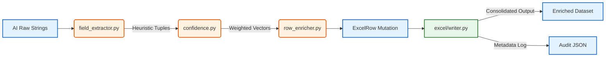

# 🧬 Semantic Data Enrichment Layer: Implementation Framework
**AI Tricom Hunter: Orchestrating the Metadata Consolidation Protocol**

This document delineates the architectural imperatives for integrating a comprehensive Semantic Data Enrichment subsystem. The objective is to transition from a single-variable inference model (e.g., retrieving only telephone vectors) to a multi-variable contextual synthesizer capable of producing fully instantiated corporate entity records accompanied by exhaustive, compliance-ready JSON audit trails.

---

## 1. Meta-Analysis: Structural Data Deltas

An empirical evaluation of the existing ingestion matrix (`pre_process.py`) versus the output ledger reveals a highly skewed density factor; actionable intelligence is chronically discarded.

### Identified Gap Analysis Matrix

| Semantic Variable | Present in Base Matrix | Current NLP Evaluation Extraction | Theoretical Enrichment Potential |
| :--- | :--- | :--- | :--- |
| `Corporate Entity (Nom)` | Boolean (Yes) | Ingest Only (No parsing) | Null |
| `Spatial Vector (Adresse)` | Boolean (Yes) | Ingest Only (No parsing) | Null |
| `SIREN Taxonomy` | Boolean (Partial) | RegEx `\d{9}` inference | Very High |
| `SIRET Taxonomy` | Probability (Low) | Ignored State | High |
| `Email Identifier` | Null state | Ignored State | Extremely High |
| `Entity API / URI` | Null state | Ignored State | Extremely High |
| `NAF/APE Codification`| Null state | Ignored State | Substantial |
| `Legal Taxonomy` | Null state | Ignored State | High |
| `Executive Body` | Null state | Ignored State | Medium |
| `Capitalization Volume` | Null state | Ignored State | Medium |
| `Macro-Spatial (Code Postal)`| Probability (Low) | Ignored State | Substantial |

### Current Computational Waste
The AI models inherently generate secondary data variables as artifacts of evaluating the initial prompt (e.g., Google’s SGE outputs the website while verifying a phone number). Currently, the memory buffer purges this highly correlated latent datum post-execution.

---

## 2. Decoupled Topological Subsystem Modules

The Enrichment architecture necessitates strict modularity, abstracting specific operations into granular processing functions.



### Module Descriptions:
1. `enrichment/field_extractor.py`: A pure functional construct. It leverages sophisticated pattern-matching constraints (Regex constraints bounding NAF, Siret) to synthesize heterogeneous variables without applying side effects.
2. `enrichment/confidence.py`: Evaluates inferred data tuples probabilistically against their source authority (e.g., Schema.org vs. DuckDuckGo API) ensuring optimum data precedence logic.
3. `enrichment/row_enricher.py`: The single-instance Mutator logic acting against the `ExcelRow` class structure, orchestrating variable assignment based strictly on missing bounds.

---

## 3. Reliability Weights and Probabilistic Inference

To probabilistically infer truth values when presented with contradictory variables (e.g., two distinct SIREN codes), the system utilizes a weighted trust hierarchy. 

**Source Confidence Heuristics (`enrichment/confidence.py`)**:

```python
# Absolute Trust Weight Factors
SOURCE_AUTHORITY_WEIGHTS = {
    "aeo_schema":   1.00,   # Absolute certainty via structural Semantic Web standards.
    "gemini_json":  0.90,   # High probability contextual output via RAG.
    "google_ai":    0.75,   # SERP Generative logic (subject to minor hallucination bounds).
    "duckduckgo":   0.65,   # NLP chat agent inference.
    "page_html":    0.45,   # High-noise standard scraper DOM string parsing.
    "heuristic":    0.30,   # Final threshold pure regex guesswork.
}
```
The algorithm dynamically calculates an `effective_score` by multiplying the `SOURCE_AUTHORITY_WEIGHTS` with intrinsic sub-routine confidence limits (e.g., standard regex $R = 0.90$). The scalar possessing the highest final score dominates the mutation block.

---

## 4. Compliance Logging: The Audit Subsystem (`_AUDIT.json`)

To sustain EEAT verisimilitude, every deterministic output must map accurately against its generative inputs. The updated `excel/writer.py` subsystem must export an immutable JSON array bounding:

- **Chronological Data (Time-Series):** Row-bound wall-clock initialization vs iteration completion ($\Delta t$).
- **Anti-Bot Trace Metrics:** Discrete block logging correlating proxy rotations to specific input variables.
- **Query Artifacts:** Archival logging of generated Search Engine prompts and complete LLM string artifacts (truncated logically to $< 3000$ bytes).
- **Enrichment Origin Vectors:** Documentation verifying `source` string, calculated `confidence` variable, and alternative `candidates` considered before value assignment.

### Example Schema Excerpt
```json
{
  "row_index": 3,
  "status": "DONE",
  "processing_seconds": 14.7,
  "enriched_data": {
    "siren": {
      "value": "123456789",
      "source": "aeo_schema",
      "confidence": 0.9,
      "candidates": [
        { "value": "123456789", "source": "aeo_schema", "confidence": 0.9 }
      ]
    }
  }
}
```

---

## 5. Architectural Horizon Constraints

Subsequent iterations beyond this structured enrichment scope must interface fundamentally through Caching Layers utilizing localized DB structures (e.g., SQLite via `cache/siren_cache.py`) to bypass continuous API/Scraper latency for repeated corporate entities detected recursively across discrete excel uploads.
