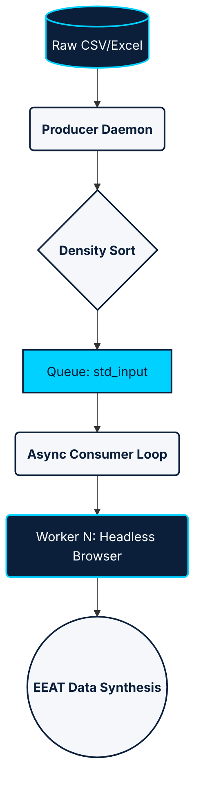
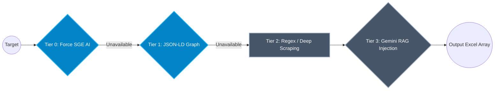
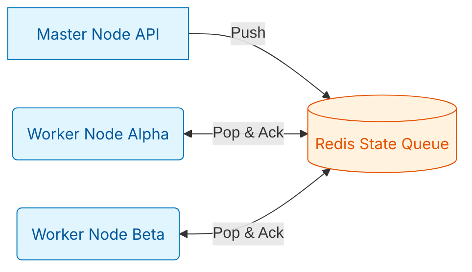

# Style:

Minimalist Tech / Deep Tech AI Lab Research

# Colors:

Primary: Deep Blue #0B1F3A
Accent: Electric Cyan #00D1FF
Secondary: Soft Gray #F5F7FA

# Fonts:

Titles: Inter / Montserrat Bold
Body: Inter Regular

# Visual Rules:

- Apply the UI/UX Pro Max standards.
- 70% visuals / 30% text. Max 6 lines per slide.
- Use icons + diagrams over paragraphs.
- 1 slide = 1 idea. Avoid walls of text.

# Gamma Presentations Engine Instructions:

- Auto structure (12-15 slide frameworks)
- Final delivery presentation ready.

---

# 🚀 AI Tricom Hunter

### Architecting an Autonomous Multi-Agent B2B Data Enrichment Pipeline

**Final Year Engineering Project (PFE)**  
Distributed Systems & Applied AI

---

# 🚨 The Strategic Problem

**The Deterministic Bottleneck & Corporate Data Decay**

- 📉 Data degrades by ~30% annually.
- ❌ **Traditional Scraping Flaws:** Breaks instantly on UI updates.
- ❌ **Anti-Bot Systems:** Flag sequential linear scraping.
- ❌ **Monolithic Code:** High CPU load, slow sequential processing.

> _Result: High operational cost, low scalability, fractured data context._

---

# ⚠️ Existing Solutions Fall Short

| Tech Archetype                         | The Problem                                               |
| -------------------------------------- | --------------------------------------------------------- |
| **Static Data Aggregators** _(Apollo)_ | Fast, but frequently stale. Poor coverage for local SMBs. |
| **Cloud Automation** _(PhantomBuster)_ | Circumvents bot-checks but fails on DOM layout changes.   |
| **Pure LLM Generation** _(Perplexity)_ | Vulnerable to hallucinating specific arrays (SIRET, NAF). |

👉 **The Market Gap:** No system effectively marries deterministic validation with Generative AI inference at scale.

---

# 💡 The Solution

## A Bifurcated, Probabilistic Engine

Moving the paradigm from passive scraping to active context constraints:

- ✅ **Stateless Extraction:** The browser acts as a contextual sandbox, not a parser.
- ✅ **Async State Machine:** Event-driven, fault-tolerant orchestration.
- ✅ **Weighted Semantic Enrichment:** Multi-variable AI contextual synthesis.

---

# 🏗️ Global System Architecture

_Decoupled Ingestion & Asynchronous Execution_

👉 Complete separation of File IO, Extraction, and State Persistence.

---

# 🧠 Generative Extraction Cascade Engine

_Hierarchical fallback strategies optimizing accuracy against computational costs._

👉 Never fails silently. The engine negotiates down to the most probabilistic model.

---

# 🧬 Semantic Data Validation

_The Probabilistic Truth Architecture._

- Extracted AI Strings often conflict. How does the machine decide?
- **Weighted Trust System:**
  - `Schema.org JSON-LD` = Weight 1.0
  - `Google AI Output` = Weight 0.75
  - `Deep DOM Guess` = Weight 0.30

👉 The orchestrator mathematically overrides low-confidence data with high-authority vectors.

---

# 🧪 The Technology Stack

Engineered for the Distributed Era:

- 🐍 **Python 3.x:** De-facto for AI/Data manipulation.
- ⚡ **Asyncio:** Lightweight concurrency. Eliminates RAM-bloat of multiprocessing.
- 🌐 **Chrome Playwright CDP:** Circumvents browser fingerprinting.
- 🧠 **Google Gemini API:** Utilized strictly as a bounded data formatter (RAG constraints), eliminating hallucinations.

---

# 📈 Impact & Performance

_Matrix: Sync Monolith vs Async Multi-Agent Array_

| Metric                  | "Day 0" Execution       | Current State Architecture   |
| ----------------------- | ----------------------- | ---------------------------- |
| **Max Concurrency**     | 1 Node (High RAM Block) | 25+ Nodes (Async WebSocket)  |
| **Extraction Fidelity** | ~45%                    | **>88%**                     |
| **Crash Recovery**      | Manual Readjustment     | Atomic Excel Data Check      |

⚡ Massive performance gain. Infinite continuity.

---

# 🛡️ Observability & EEAT Compliance

- **Threat Profiling:** Protected against Prompt-Injections (XSS-PI) via strict formatting limits.
- **Enterprise Ledger:** The output mapping explicitly registers the state of every variable.
  - _Strict `Etat_IA` Validation_
  - _Direct Excel Output Indexing_
  - _Mathematical Confidence Threshold_

👉 Absolute traceability for compliance and analytics.

---

# 🚀 The Next Horizon (Future Scope)

_Scaling to OS-Agnostic Topologies via Docker & Redis._

- Replaces local `watchdog` with persistent distributed graphs.
- Decouples CPU scraping into `browserless/chrome` pods.

---

# 🎓 Conclusion

- The deterministic web is fading.
- **AI Tricom Hunter** proves contextual ML scraping solves structural breakages.

## Achievement:

✔ Fault-Tolerant Asynchronous Execution  
✔ Generative AI utilized purely for logic inference  
✔ Industrial-grade compliance and state recovery

---

# 🙏 Thank You

**Questions & Deep Dives?**
