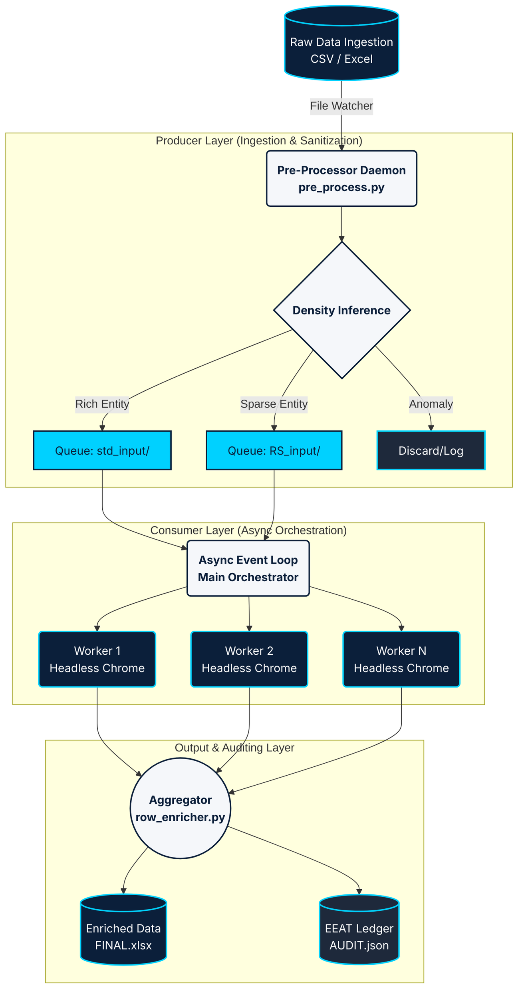

# 🏗️ Global System Architecture
**Diagram 01: Producer-Consumer Paradigm & Data Lifecycle**

*Context: This macro-architecture diagram illustrates the decoupling of ingestion (Producer) from the asynchronous AI execution engines (Consumers) via file-based state queues.*

> **Usage:** Insert this diagram into slide "# ⚙️ Data Pipeline Workflow" to visualize the async Producer-Consumer decoupling.
