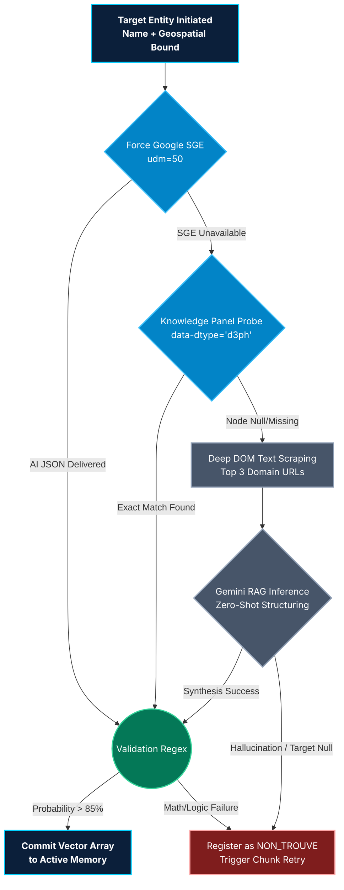

# 🧠 Generative Extraction Cascade Engine
**Diagram 02: Heuristic Fallback & Cost-Optimization Routing**

*Context: This flowchart details the decision matrix the extraction agent uses to balance highest-accuracy/lowest-cost queries against probabilistic fallback generations.*

> **Usage:** Insert this logic map into slide "# 🧠 Core Innovation" to illustrate the cascading safety net and why the system does not fail silently.
