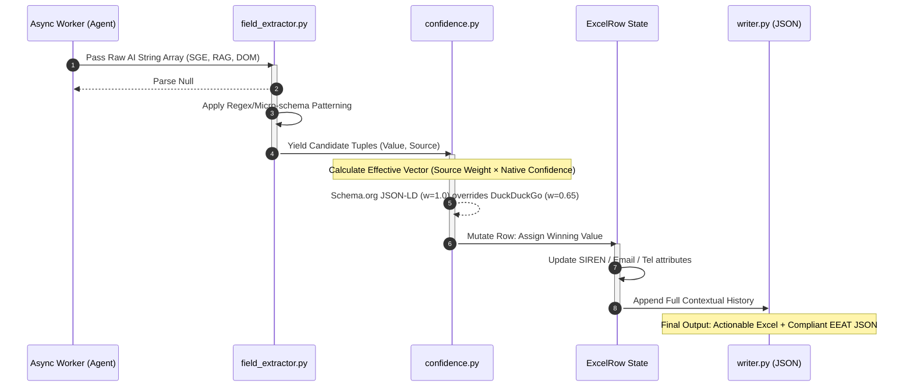

# 🧬 Semantic Data Validation and Enrichment
**Diagram 03: The Probabilistic Truth Engine**

*Context: Explains the internal communication between sub-routines when assigning missing corporate descriptors based on extracted AI strings.*

> **Usage:** Useful for the Data Enrichment/Assurance section to prove data integrity and GDPR/EEAT compliance through algorithmic auditing.
