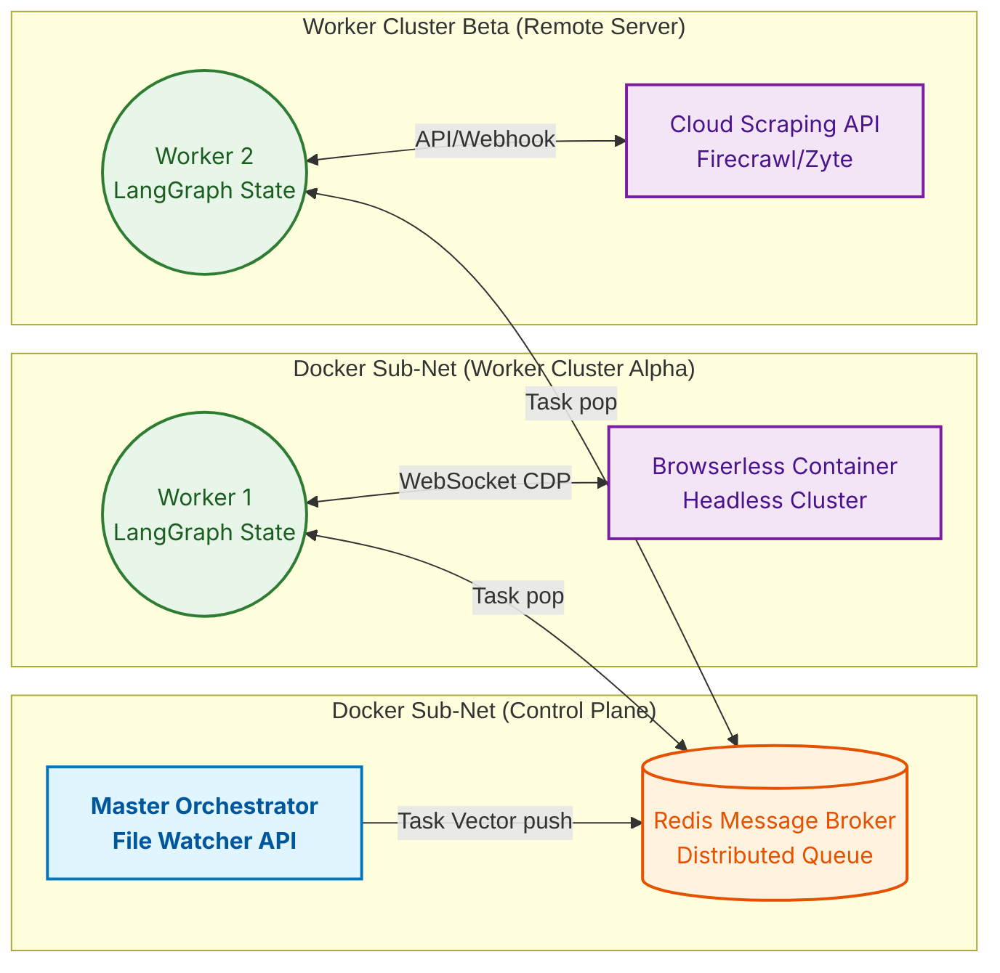

# 🌐 Distributed Infrastructure Target Topology
**Diagram 05: Future Scale & OS-Agnostic Abstraction**

*Context: A physical deployment topography outlining how the system scales across disparate servers utilizing Docker bounds and Pub/Sub networks. Suitable for the "Future Work" or "Horizon" segments.*

> **Usage:** Place this in the "# 🚀 Future Work" slide. It clearly highlights moving from localized asynchronous threads to a fully horizontally-scaled distributed swarm.
