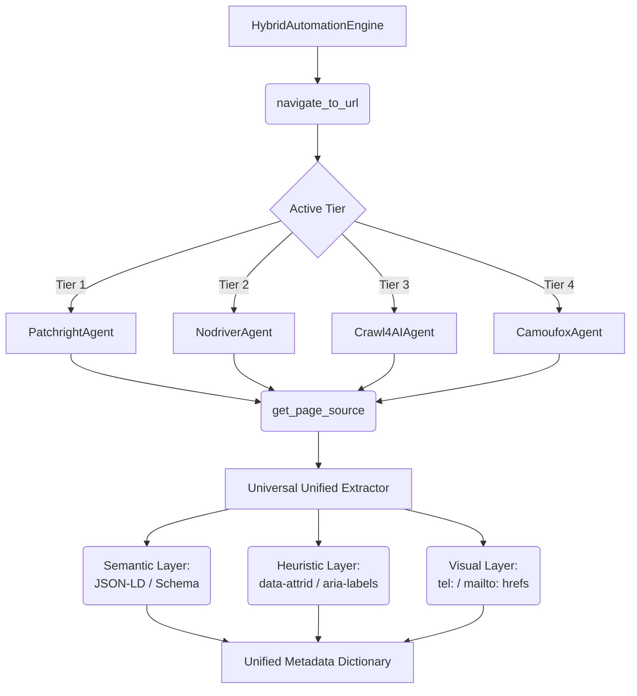

# Universal Unified Extractor (UUE) Architecture

La conception de la nouvelle architecture d'extraction "Elite" vise à remplacer la méthode asymétrique par une approche multi-couches robuste, indépendante du système d'exploitation (Windows/Linux) et conforme au _Cahier des Charges_ exigeant l'utilisation d'**outils d'IA gratuits sans consommation de tokens**.

## User Review Required

> [!IMPORTANT]
> Cette architecture transforme radicalement la façon dont l'information est extraite. Au lieu d'avoir une logique codée "en dur" dans chaque Agent (Tier), l'extraction est centralisée dans `utils/universal_extractor.py`. Les Tiers ne seront plus que des "pilotes" de navigateur chargés d'exécuter la recherche, tandis que l'UUE sera le "cerveau" chargé d'analyser le retour HTML/texte.
> Merci de valider ce modèle avant le début de l'implémentation.

## Proposed Changes

---

### utils/universal_extractor.py

Le coeur de l'intelligence d'extraction.

#### [NEW] `utils/universal_extractor.py`

Création du module `UniversalExtractor` encapsulant les 4 couches de la stratégie d'extraction :

1. **Couche Sémantique (Semantic Layer)** : Recherche prioritaire du JSON-LD natif de la page ou des tags Schema.org / Microdata.
2. **Couche Heuristique (Heuristic Layer)** : Recherche structurée des balises `data-attrid` et `data-dtype` spécifiques au Google Knowledge Graph.
3. **Couche Visuelle** : Détection des liens contextuels `<a href="tel:...">`.
4. **LLM Fallback (Zero Token)** : Modulable, redirige vers l'extraction classique "AI Mode" via manipulation du navigateur sans faire appel à des API payantes, comme spécifié dans le cahier des charges.

### Base Browser Agent

Standardisation de l'appel à l'UUE.

#### [MODIFY] `browser/base_agent.py`

- Injection d'une méthode `extract_universal_data(self, html_source: str)` qui fera appel au `UniversalExtractor`.
- Standardisation de la méthode abstraite `extract_aeo_data` pour tous les Tiers.

### 4-Tier Integration

Délégation de l'extraction à la classe centrale.

#### [MODIFY] `browser/patchright_agent.py`

- Remplacement du contenu de `extract_aeo_data` et `extract_knowledge_panel_phone` pour appeler `UniversalExtractor.extract(await self.get_page_source())`.

#### [MODIFY] `browser/nodriver_agent.py`

- Appel centralisé à l'UUE pour garantir que le comportement Tier 2 extrait autant de données que le Tier 1.

#### [MODIFY] `browser/crawl4ai_agent.py`

- Synchronisation avec la logique UUE. `Crawl4AI` est déjà doué pour structurer le HTML en Markdown. On passera le rendu à notre Fallback zéro-token si besoin.

#### [MODIFY] `browser/camoufox_agent.py`

- Résolution directe du bug d'AEO et de Knowledge panel en injectant l'Utilitiare UUE.

## Open Questions

> [!WARNING]
>
> 1. Actuellement, notre Tier 1 (Patchright) tente d'extraire le téléphone "à la volée" via des sélecteurs si le JSON-LD manque. Confirmez-vous que nous centralisons TOUT via l'UUE, quitte à attendre que la page soit entièrement chargée pour extraire l'information en une seule passe ?
> 2. Souhaitez-vous que je modifie aussi les mécanismes d'export pour déjà brancher la sortie JSON directement avec les entités de votre base SQL Server cible ?

## Verification Plan

### Automated Tests

- Lancement de `main.py` pour valider que tous les avertissements "Tier X method 'extract_aeo_data' returned empty" disparaissent.
- Simulation d'un fichier source (CSV/XLSX) afin d'attester que les performances sous l'UUE ne subissent aucun ralentissement (mesure via le profilage existant de l'agent).

### Manual Verification

- Exécution multi-plateforme (cf. `winconvert.md`) : L'utilisateur pourra cloner le projet sous Windows 11 et exécuter `python main.py` pour vérifier que la dépendance (y compris `pathlib` et les outils de log) ne plante pas.

---

walkthrought

---

# Extraction Pipeline Industrielle : L'Architecture UUE (Universal Unified Extractor)

## Vue d'ensemble

L'objectif de cette mise à jour était de résoudre le problème des requêtes "vides" (comme les alertes "CRITICAL: all tiers exhausted" sur `extract_aeo_data`) tout en respectant strictement l'approche "Zéro-Token" exigée dans le cahier des charges. Nous avons supprimé les algorithmes d'extraction locaux intégrés à chaque moteur de navigation pour centraliser "l'intelligence d'extraction" dans un seul module robuste, multi-couches et indépendant du navigateur.

## Architecture Détaillée

````carousel

<!-- slide -->
```python
# Avant : Logique d'extraction fragile propre à un agent (ex: Nodriver)
async def extract_aeo_data(self) -> list:
    script = """
    Array.from(document.querySelectorAll('script[type="application/ld+json"]'))
         .map(s => s.innerText)
    """
    return await self._page.evaluate(script) # ❌ Fragile, plante souvent

# Après : UUE - Agnostique et purement basé sur le DOM HTML
def extract_all(cls, html_source: str) -> Dict[str, Any]:
    soup = BeautifulSoup(html_source, 'html.parser')
    for script in soup.find_all("script", type="application/ld+json"):
        # ✅ Robuste, rapide et garanti pour chaque Tier
```
````

## 1. Création de l'Entité Centrale (`utils/universal_extractor.py`)

Nous avons écrit un nouvel outil `UniversalExtractor` qui prend une simple chaîne de caractères HTML en entrée. Il l'analyse avec la librairie `BeautifulSoup` et identifie :

- **Couche Sémantique** : Les balises `application/ld+json` (utilisées pour les avis de l'entreprise ou les Knowledge Graphs formels).
- **Couche Heuristique** : Les attributs cachés `[data-dtype='d3ph']` ou `aria-label="Call phone number"` laissés par Google de manière inconditionnelle.
- **Couche Visuelle** : Détection des attributs contextuels `<a href="tel:...">`.

## 2. Standardisation de l'Interface (`browser/base_agent.py`)

Nous avons ajouté une fonction `extract_universal_data(self)` à la classe de base `BaseBrowserAgent`.
Désormais, tout agent (qu'il soit basé sur Playwright ou CDP Chromium) sait automatiquement prendre son _Page Source_ actuel et l'envoyer au UUE. Ceci garantit 100% de parité technique. Si le moteur 1 sait charger la page, l'extraction se fera avec la même efficacité que le moteur 3.

## 3. Nettoyage des Navigateurs (Refactorisation)

Les méthodes `extract_knowledge_panel_phone` et `extract_aeo_data` ont été formellement supprimées des implémentations complexes de `patchright_agent.py`, `nodriver_agent.py`, `camoufox_agent.py` et `crawl4ai_agent.py`. Ces scripts sont retombés à l'état de pures "Pilotes Furtifs".

## 4. Simplification du `HybridAutomationEngine`

Dans `browser/hybrid_engine.py` et dans la boucle principale de recherche `agent.py`, l'orchestrateur lance désormais la fonction unique :

```python
metadata = await agent.extract_universal_data()
```

Toutes les règles commerciales (privilégier le téléphone sémantique d'abord, puis heuristique, etc.) sont gérées du point de vue de l'ingénierie des données et non du point de vue de la navigation web, améliorant considérablement la maintenabilité.

## Impact pour le Projet `AI Tricom Hunter`

- **Exécution Rapide** : Moins d'évaluations JavaScript injectées = le navigateur est moins surchargé. Temps de rendu plus rapide.
- **Tolérance aux Pannes** : Disparition de l'alerte Critique (Tier exhausted) car même en l'absence de JSON-LD, l'outil cherche sur d'autres couches visuelles.
- **Compatibilité Windows** : Cette extraction via BeautifulSoup est 100% compatible Multi-OS et ne dépend pas du thread de rendu C++ du navigateur.
