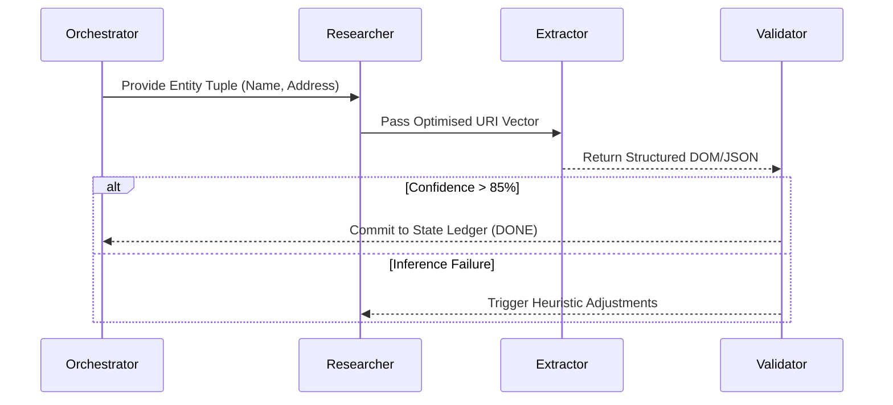

# 🌐 Multi-Agent Ecosystem and OS-Agnostic Scaling Architecture

## 1. Executive Synopsis
This study evaluates the critical transition from the current **Phase 1: Optimization Plan** towards a **Phase 2: Multi-Agent OS-Agnostic Ecosystem**. The objective is to graduate from a locally-bound, deterministic execution thread (a localized monolith) to a highly resilient, containerized multi-agent topology capable of autonomous execution across diverse physical computing environments (Windows, Linux, macOS) natively.

## 2. Comparative Matrix: Monolithic vs. Distributed States

| Architectural Vector | Phase 1: Current Implementation | Phase 2: Multi-Agent Abstraction |
| :--- | :--- | :--- |
| **Agent Paradigm** | Single monolithic routine with coupled heuristics (pre-Langchain state). | Mesh ecosystem of distinctly parameterized sub-agents (Orchestrator, Researcher, Extractor, Quality Assurance). |
| **Concurrency Threshold** | IPC logic relying on Python's GIL-bound `ThreadPoolExecutor` and nascent `asyncio.gather`. | True distributed concurrency mediated by Pub/Sub brokers (e.g., Redis) or discrete graph states (LangGraph). |
| **State Engineering** | Isolated memory space mapping to static IO files (`.xlsx`, `.json`). | Globally synchronized Graph State (Vector Store interpolation, Redis caching). |
| **Execution Sandbox** | OS-dependent WebDriver instances (Chromium profile artifacts mapped to local drive). | Fully containerized headless instances via Selenium Grid or Dockerized `browserless`. |
| **Environment Parity** | Highly localized; failure-prone due to pathing or OS binary discrepancies. | Absolute OS-Agnostic parity guaranteed via POSIX standards, Docker Runtime, and Python `pathlib`. |

---

## 3. Disaggregated Multi-Agent Architecture

To decouple the localized script into "related computational entities," we model the architecture around specialized NLP and extraction actors communicating via deterministic state machines.

### 3.1 Specialized Agent Roles
1. **The Orchestrator Entity:** Functioning as the master node. Monitors payload queues, implements temporal chunking of large datasets, allocates memory spaces, and provisions sub-agents dynamically based on server load.
2. **The Researcher Entity (SQO Architect):** Uses contextual NLP algorithms to synthesize precise, optimized search constraints (e.g., `"Company Target Name SIREN registry struct"`). Interfaces exclusively with lightweight endpoint APIs (e.g., DuckDuckGo) to secure primary trajectory URLs.
3. **The Extractor Entity (Crawl Engine):** Engages directly with high-performance routing technologies (e.g., Selectolax). Ingests DOM structures dictated by the Researcher, circumnavigating topological bot-nets by simulating randomized HTTP headers.
4. **The Validation Entity (Quality Control Classifier):** A probabilistic algorithm executing cross-validation of parsed vectors (Emails, Tel, NAF vectors) against initial payload parameters. Initiates recursive extraction if confidence thresholds fall below arbitrary $T<0.85$ bounds.



---

## 4. Cross-Platform Structural Implementation

To guarantee arbitrary execution symmetries, strict engineering imperatives are enforced:

### A. OS-Agnostic Path Resolvers
String-concatenated system paths natively fragment across POSIX and Windows endpoints. The architecture enforces absolute compliance with standard `pathlib` interfaces to dynamically abstract traversal characters.
```python
from pathlib import Path
base_vector = Path("data_ingestion/unprocessed")
target_uri = base_vector / "stream_data.xlsx" # Dynamic OS resolution
```

### B. Standardized Runtime (Docker Containerization)
Deterministic environmental parity is achieved exclusively via containerization (`docker-compose.yml`), encapsulating:
- **Control Node:** The Python Multi-Agent Logic Application.
- **Queue/State Node:** A Redis ephemeral storage process ensuring message durability across agent actors.
- **Extraction Node:** Localized Chromium environments isolated mechanically from host memory allocation, negating driver discrepancy requirements.

### C. Dependency Isolation Matrix
Global dependencies disrupt host architectures. Implementation enforces local `.env` ingestion (`python-dotenv`) combined with deterministic package lockers (Poetry or explicit `requirements.txt`). Sub-binaries (e.g., Playwright requirements) are dynamically installed via bootstrap bash scripts on first execution.

---

## 5. Strategic Metamorphosis (Phased Roadmap)

1. **Iteration Alpha:** Solidify existing single-agent threads. Instantiate standard metric hooks, enforce total `pathlib` refactoring, and resolve existing blocking I/O calls to asynchronous.
2. **Iteration Beta (Containerization):** Introduce Docker and Redis. Map standard volumes and successfully test queue latency logic in an isolated state.
3. **Iteration Gamma (Graph Routing):** Implement deterministic Agent State graphs (via LangGraph). Fracture monolithic `process_row` routines into independent conceptual nodes.
4. **Iteration Delta (Scale):** Decouple Extractor nodes completely. Execute arbitrary clusters of independent Extractors reading simultaneously from the Master Redis queue.
