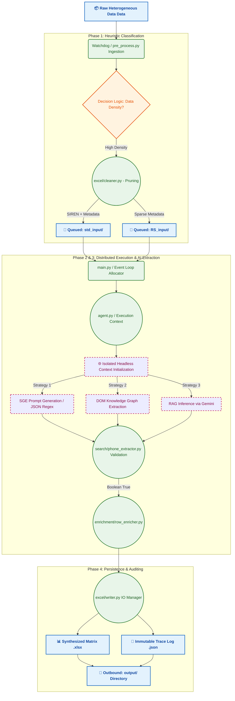

# 🏭 Data Pipeline Workflow and Visual Architecture
**AI Tricom Hunter: Structural Processing Graph**

This document provides a highly detailed architectural visualization and corresponding technical breakdown of the data lifecycle within the AI Tricom Hunter system. The logic is segmented into a multi-phase, deterministic workflow ensuring complete traceability from raw data ingestion to enriched enterprise outputs.

## 1. System Operations Lifecycle

The data pipeline utilizes a strict **Producer-Consumer** pattern, guaranteeing isolated transaction contexts and robust failure mitigation.

### Phase 1: Ingestion & Heuristic Classification (Producer)
**Target:** Ingest heterogeneous datasets, sanitize them, and route them to categorical queues.
- A daemonized process (`pre_process.py`) continuously monitors the `incoming` directory using file-system events.
- Raw CSV, XLS, or XLSX files are parsed; anomalous structural data (e.g., null primary keys, redundant headers) is pruned.
- Data points are classified based on information density (e.g., Address + SIREN versus solely Corporate Name) and partitioned into segregated processing queues like `std_input` and `RS_input`.

### Phase 2: Asynchronous Orchestration (Queue Management)
**Target:** Act as the intermediary state machine between sanitized input and AI processing.
- The `Watchdog` subsystem within the consumer (`main.py`) identifies state changes in the `ready_to_process` queues. 
- Using `asyncio`, the engine allocates execution threads to distinct browser instances, circumventing single-thread blocking bottlenecks.

### Phase 3: Generative and Algorithmic Extraction (Consumer / Worker)
**Target:** Execute cascading search strategies to fetch, parse, and structure missing metadata.
- **Node A (Initial Query):** The `agent.py` orchestrator launches isolated web environments via Playwright/Selenium.
- **Node B (Tier-0 SGE Extraction):** The system forcibly invokes Google's Search Generative Engine using highly engineered prompts. If successful, parsing of the resultant JSON bypasses further DOM interaction.
- **Node C (Knowledge Graph parsing):** If Tier-0 fails, structural DOM selectors extract specific micro-formats (`data-dtype='d3ph'`) from semantic web cards.
- **Node D (GEO / RAG Recovery):** As a final measure, text scraped from top institutional results acts as context (RAG) for Gemini, which infers the missing features.
- Regex validators in `phone_extractor.py` assure data fidelity before returning values to the state machine.

### Phase 4: Output Synthesis & Auditing
**Target:** Consolidate vectors into a unified output, alongside comprehensive meta-logging.
- The `row_enricher.py` subsystem systematically patches gaps in the initial dataset.
- The `excel/writer.py` subsystem exports the enriched matrix while concurrently writing immutable JSON traces summarizing extraction vectors, execution overhead, and CAPTCHA mitigation statistics.

---

## 2. Global Execution Topography (Mermaid Flowchart)

The following computational graph traces the exact structural flow of data packets throughout the system.

### 🧠 Architectural Rationale
The adherence to strict structural modularity prevents catastrophic system failures. Decoupling extraction logic (`search`), state management (`excel`), and IO processes (`writer`) allows engineers to patch individual heuristic functions (e.g., adapting to upstream Google DOM shifts) without requiring re-compilation or testing of the broader IO pipelines. This embodies theoretical best practices in asynchronous multi-agent distributed systems.
